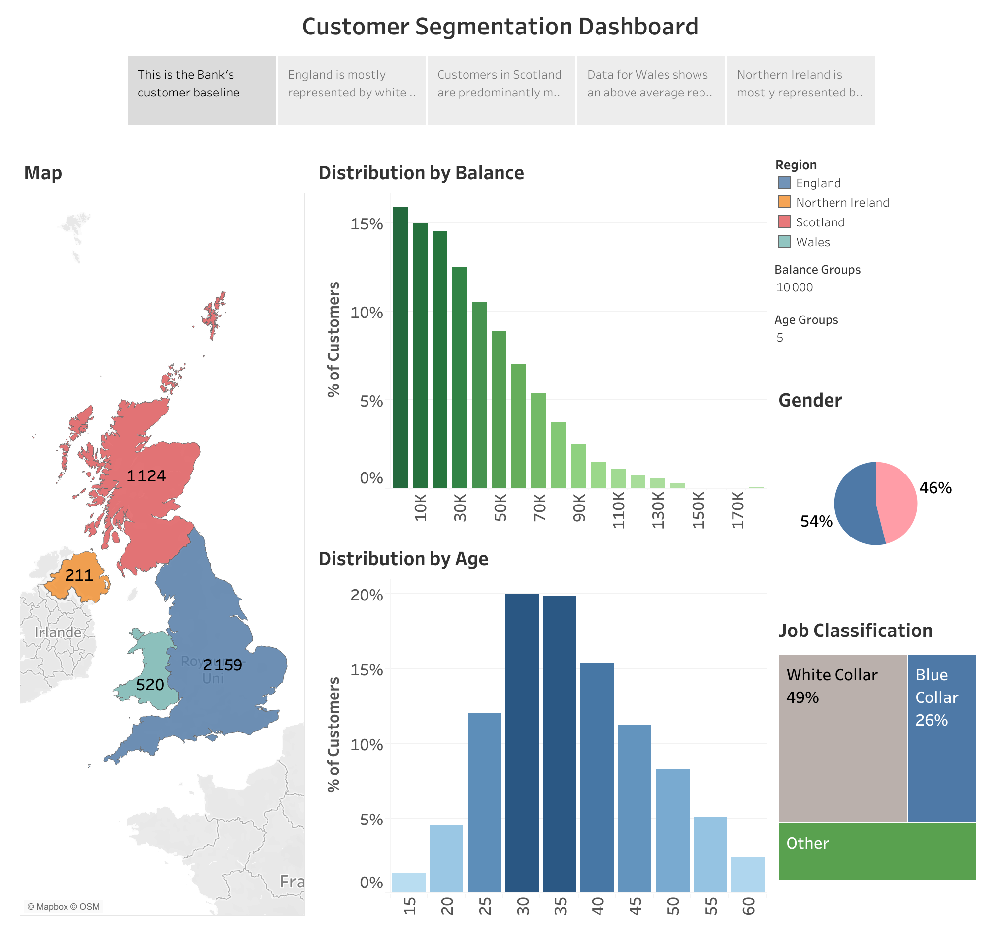

# Bank Customer Segmentation

## Contexte
Analyse de la base clients d'une banque britannique (4 014 clients, 
4 régions : England, Scotland, Wales, Northern Ireland). L'objectif 
est de comprendre le profil des clients selon plusieurs dimensions : 
solde bancaire, âge, genre et catégorie socio-professionnelle.

## Problématique
Quelles sont les caractéristiques des clients par région, et quels 
profils se dégagent de la base ?

## Démarche
- Cartographie des clients par région (carte choroplèthe)
- Distribution des soldes bancaires par tranches
- Distribution par âge avec paramètre ajustable
- Répartition par genre et classification professionnelle
- Story Tableau pour guider la lecture région par région

## Compétences mobilisées
- Story Tableau
- Dashboard interactif
- Paramètres dynamiques (Balance Groups, Age Groups)
- Cartographie
- Treemap, histogrammes, pie chart

## Visualisation

🔗 [Voir sur Tableau Public](https://public.tableau.com/views/BankCustomerSegmentation_17729361074370/BankCustomerSegmentation)

## Outils
- Tableau Public

## Données
Jeu de données fictif (exercice pédagogique) — 4 014 lignes, 11 champs.
